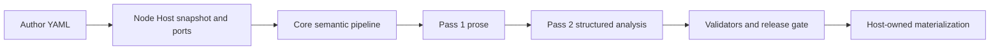

# Fabula — 叙事工程系统

Fabula is a narrative-engineering system: structured author YAML becomes canonical story state, controlled render context, two-pass scene output, and output-level validation before assembly. The product entry is the **Workbench** — a browser-first collaborative authoring Host with a built-in creation agent; a headless CLI and an MCP surface serve automation, testing, and external agents.

**Verified current status:** [docs/current-state.md](docs/current-state.md). It is the operational source of truth; this README is a concise entry point.

## 快速开始：npm install && npm start

Requires Node `26.5.0` through `fnm`. Clone, install, build, and start:

```bash
git clone <repository-url> fabula
cd fabula
fnm exec --using=26.5.0 -- npm install
fnm exec --using=26.5.0 -- npm run build
fnm exec --using=26.5.0 -- npm start
```

`npm start` rebuilds the Workbench Host, starts it on loopback (`http://127.0.0.1:8787`), prints the URL, and opens your browser automatically (`WORKBENCH_OPEN_BROWSER=false` disables auto-open). The **first-run guide** walks through owner setup, adding a project, and configuring the provider, API key, and network policy — then drops you into the workspace with the built-in agent chat.

Provider API keys are stored through the **settings UI**, never in `.env`: environment variables only control launch location, listener, and explicit development mocks. See [docs/reference/workbench-host.md](docs/reference/workbench-host.md) for the run and configuration reference.

## 内置创作代理

The built-in agent completes the whole creation loop through its tools — view status, edit, validate, submit, render, review, publish — while you chat and inspect the artifacts.

## 外部 agent 接入

The Workbench is an MCP server. Any MCP client — including external agents such as the codex CLI or Claude Code — can connect to `/mcp/projects/:projectId` (Streamable HTTP) and use the same `nova_*` 72-tool catalog as the built-in agent, filtered by role scope. The endpoint and tool catalog are unchanged by the CLI rename; `nova.yaml` project files and `NOVALISTICALLY_*` environment contracts stay as they are.

**Runtime boundary**: the built-in agent (pi-agent-core) is the **only in-process agent**. The Workbench does not discover, spawn, or host any external local agent runtime (codex CLI, etc.) — external agents connect to the MCP endpoint as clients, and that is the whole integration surface. No interface is reserved for future runtime hosting; a real need (for example driving an external coding agent from inside the Workbench) is a new feature request and gets a separate review.

## Headless CLI（自动化/测试）

The CLI (`fabula`) is a headless automation and testing tool; the product entry is the Workbench.

```bash
npx fabula --help
```

Create and inspect an authoring project:

```bash
# Create a minimal valid project without Git history.
npx fabula project init my-novel
cd my-novel

# Validate the complete source snapshot, inspect progress, and export its DAG.
npx fabula validate
npx fabula status
npx fabula graph --format mermaid
```

`project init` creates `nova.yaml`, the required initial-state and entity-type files, a narrator, an optional discourse ledger, and a first chapter/event. `validate` must pass before treating a project as render-ready.

Render deliberately — `render` defaults to the `ai-sdk` provider. Configure it explicitly in the invoking shell; the CLI does **not** auto-load `.env`:

```bash
export NOVALISTICALLY_AI_API_KEY='<provider-key>'
export NOVALISTICALLY_AI_BASE_URL='https://your-openai-compatible-endpoint/v1' # optional
export NOVALISTICALLY_AI_MODEL='your-model'                                    # optional

npx fabula render E1
npx fabula render --chapter 1
npx fabula render --all
```

For deterministic reference rendering instead of a live provider, supply the mock provider and a directory of `<eventId>.json` reference entries: `npx fabula render E1 --provider mock-pass2 --reference-dir path/to/matching-reference-data`. Render exits nonzero whenever the release gate leaves a scene unreleased, regardless of provider. See [docs/reference/cli.md](docs/reference/cli.md).

## Windows

Loopback mode is supported on all platforms, including Windows — `npm start` works out of the box. Unix-socket binding (`network.mode: unix` / `WORKBENCH_UNIX_SOCKET`) is darwin/linux only and fails with a clear error on Windows.

## System boundary



- **Core** is deterministic and pure: it owns narrative semantics, schemas, graphs, prompts, render coordination, and validator contracts. It performs no filesystem, Git, SQLite, process, or provider I/O.
- **Node Host** owns snapshot storage, provider execution, operations, cache materialization, and diagnostics.
- **CLI** owns the `commander` command and Host-bound MCP entry points over Node Host adapters.
- **Workbench Host** owns collaborative editing, Yjs, SQLite, authentication, scoped agent capabilities, native revision acceptance, and optional best-effort Git mirroring.
- Git may mirror an accepted native revision but never decides authoring acceptance or recovery.

See [docs/architecture.md](docs/architecture.md) and [docs/reference/wiring.md](docs/reference/wiring.md) for the complete boundary and runtime flow.

## Packages

| Package | Purpose |
| --- | --- |
| [`packages/core`](packages/core) | Pure narrative domain, schema validation, graph/state compilation, rendering contracts, validators |
| [`packages/node-host`](packages/node-host) | Concrete filesystem/provider/operation/cache adapters and Host services |
| [`packages/bench`](packages/bench) | Functional and performance benchmarks |
| [`packages/cli`](packages/cli) | Headless `fabula` command and Host-bound MCP entry points over Node Host |
| [`packages/workbench`](packages/workbench) | Browser-first collaborative authoring Host and client (the product entry) |

## Authoring topology

A project is path-specific, not a generic definitions/events blob:

```text
nova.yaml
definitions/
  state_initial.yaml
  entity-types.yaml
  characters/ locations/ items/ factions/ relationships/ rules/ narrators/ assertions/
discourse-ledger.yaml                         # optional
chapters/chapter_NN/
  _chapter.yaml                               # optional
  E*.yaml
```

`definitions/state_initial.yaml` and `definitions/entity-types.yaml` are required. `discourse-ledger.yaml` and chapter `_chapter.yaml` files are optional; role-based entity directories are loaded separately. See [YAML Contract Reference](docs/reference/yaml-contract/README.md) for the full format.

## Development

The workspace requires Node `26.5.0` through `fnm`.

```bash
fnm exec --using=26.5.0 -- npm install
fnm exec --using=26.5.0 -- npm test
fnm exec --using=26.5.0 -- npm run typecheck
fnm exec --using=26.5.0 -- npm run build
fnm exec --using=26.5.0 -- npm run lint
fnm exec --using=26.5.0 -- npm run bench
```

`npm test` runs the unit/component suites plus the Workbench Playwright e2e suite (requires built assets and Playwright browsers: `npx playwright install chromium`). For the Workbench Vite development flow (HMR, mock provider, env-file discovery), run `npm run start:dev`; `start:listener` is only a loopback health/status smoke listener, not the Workbench UI. See [docs/reference/workbench-host.md](docs/reference/workbench-host.md).

Agent guidance and durable memory:

- [AGENTS.md](AGENTS.md) is the repository-wide operational contract: boundaries, commands, source topology, and invariants.
- [`agents/`](agents/) contains role-specific prompt contracts. [Scribe](agents/scribe/prompt.md) is Pass 1 only: it emits prose and never analysis, state mutations, or validator decisions.
- Keep durable architectural invariants in `AGENTS.md`; keep verified, time-sensitive repository facts in [docs/current-state.md](docs/current-state.md). Do not duplicate volatile test counts or implementation status into model prompts.

## Documentation

- [Current verified state](docs/current-state.md)
- [Documentation index](docs/README.md)
- [Core/Host architecture](docs/architecture.md)
- [Runtime wiring](docs/reference/wiring.md)
- [Workbench Host reference](docs/reference/workbench-host.md)
- [YAML Contract Reference](docs/reference/yaml-contract/README.md)
- [CLI reference](docs/reference/cli.md)

Historical documents are explicitly marked under [`docs/archive/`](docs/archive/); they are not implementation authority.

## Fixtures

- `fixtures/most-dangerous-game/` — English, 6 scenes / 3 chapters
- `fixtures/arcane-aftermath/` — Chinese, 2 events
- `fixtures/zhu-fu/` and `fixtures/zhu-fu-variants/` — regression and variation suites
- `fixtures/dream-of-red-chamber/` — [`fixture-manifest.json`](./fixtures/dream-of-red-chamber/fixture-manifest.json) is the checked current inventory: 4 chapters, E01–E36; run `npm run count:drc -- fixtures/dream-of-red-chamber --check`

## License

MIT
