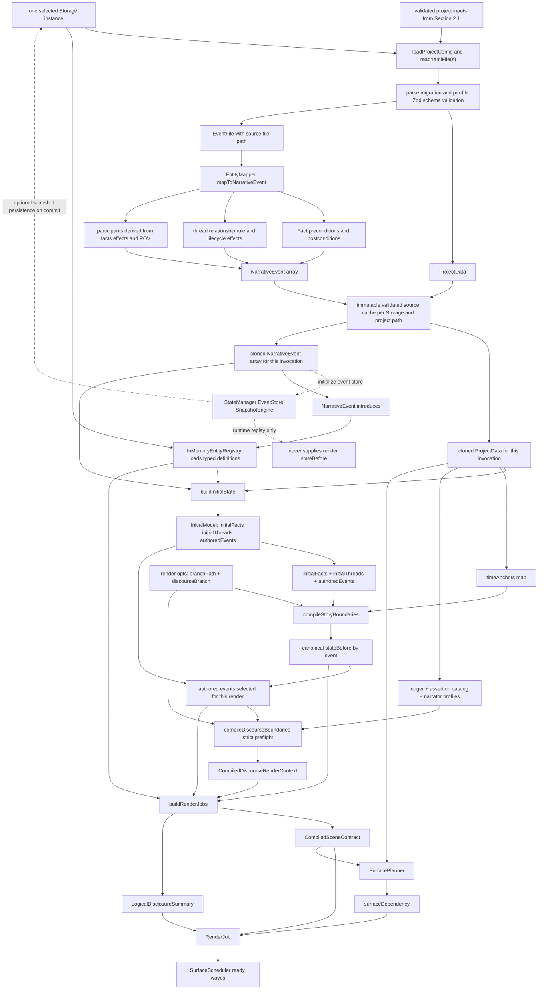
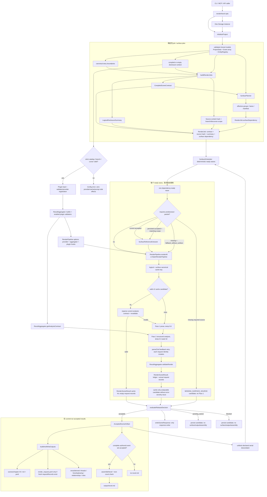
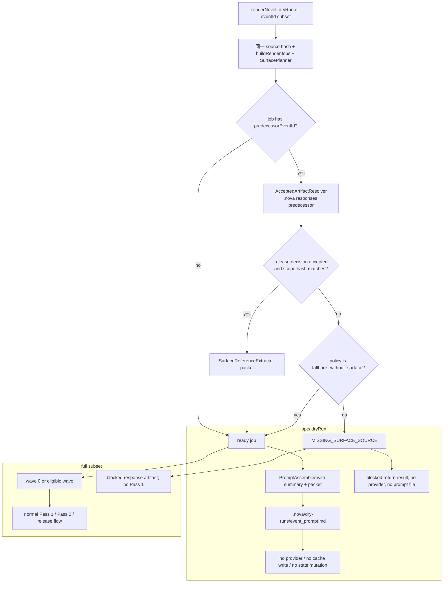
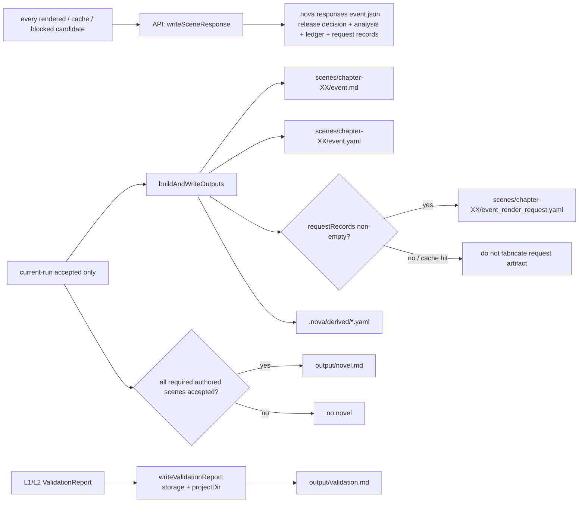

# 完整接线图：从 YAML 到发布工件

> **时间**: 2026-07-28 02:45 CST

> **适用代码**: `packages/core/src/api.ts`、`state/`、`pipeline/`、`cache/`、`validator/`、`summary/`、`reporter/`
>
> **阅读目标**: 确认一个字段、一个场景、一次渲染结果在哪个边界被读取、编译、校验、缓存、发布或拒绝。
> **现状边界**: 本文以当前 `api.ts`、`render.ts`、scheduler、release decision 与 cache 源码为准。`reference/pipeline.md` 中的旧 `computeCacheKeys()`/hash-chain、OutputWriter response 写入和固定 analysis block 数量描述不是 current wiring 的来源。

>
> **验证记录**: [接线修复验证与完整性报告](../report/wiring-remediation-verification-2026-07-27.md)

---

## 1. 不可跨越的边界

| 边界 | 唯一来源 / owner | 禁止的旁路 |
|---|---|---|
| 文件 I/O | 调用入口解析出的同一个 `Storage` 实例 | core 内部重新创建 `FsStorage`、直接 `fs` I/O |
| 逻辑世界状态 | `compileStoryBoundaries()`，内部复用 `applyNarrativeEvent()` | 从 accepted prose、Pass 2 或 surface packet 回写 WorldState |
| discourse 可见性 | `compileDiscourseBoundaries()` 的 `CompiledDiscourseRenderContext` | 用 `narrativeOrder` 猜 cursor、把 hint target 送入 prompt |
| Pass 2 契约 | `ResultAggregator.getAnalysisContract()` | prompt schema 与 parse schema 分叉 |
| 发布判定 | `evaluateReleaseDecision()` | output、cache 或 plugin 各自判断 `released` |
| response 工件 | API 的 `writeSceneResponse()` | `pipeline/output.ts` 重写 `.nova/responses` |
| surface prose | 仅 `AcceptedSceneArtifact` 经 `SurfaceReferenceExtractor` | 未接受 prose、scene `.md` 文件名、ellipsis 或 Pass 2 observation 充当 source |
| 最终小说 | `assembleNovel()` | partial accepted set 仍装配 `output/novel.md` |

`narrativeOrder` 是组装顺序，不是 replay/discourse/surface 的时间依据。Surface packet 永远是 **non-authoritative**：YAML、scene contract 与 compiled context 优先。

---

## 2. YAML 到内部建模（render scheduling 之前）

### 2.1 已采用的 YAML 目录与文件合同

`EntityMapper.loadProject()` 不读取一个泛化的 “definitions/events” blob；它按以下路径逐一
读取、迁移并以对应 Zod schema 做 strict 校验。目录型输入递归读取 `.yaml` / `.yml`；缺失的
目录得到空数组，`state_initial.yaml` 与每个已发现 chapter 的 `_chapter.yaml` 则是必需文件。
> **Story branch authoring**：EventFile 现在接受 strict event-local `choices`。外部
> `branches.yaml`、`branches/branch_points.yaml` 与 `branchPoint` 仍不被读取或接受。mapper
> 在 final mapping 前调用 `compileGameDialogueTree()`：root 保持 `{ type: 'all' }`，其余
> event 及普通 Fact 取 descendant leaf `BranchSet`，每个 choice 生成 scoped synthetic
> transition。`renderNovel({ branchPath })` 只接受完整 leaf；`renderGameDialogueTree()` 用每个
> node 的 representative path 渲染全树并写 `output/dialogue-tree.md`。discourse ledger 的
> branch label 仍独立于 story path。

```mermaid
flowchart TB
  Root["project directory"] --> Config["nova.yaml<br/>project configuration"]
  Root --> Defs["definitions directory"]
  Root --> Chapters["chapters directory"]

  subgraph DefinitionFiles["definitions"]
    Defs --> State["state_initial.yaml<br/>info; timeAnchors; threads; worldFacts"]
    Defs --> Characters["characters recursive YAML<br/>character definitions"]
    Defs --> Locations["locations recursive YAML<br/>location definitions"]
    Defs --> Items["items recursive YAML<br/>item definitions"]
    Defs --> Factions["factions recursive YAML<br/>faction definitions"]
    Defs --> Relationships["relationships recursive YAML<br/>relationship definitions"]
    Defs --> Rules["rules recursive YAML<br/>rule definitions"]
    Defs --> Narrators["narrators recursive YAML<br/>narrator profiles"]
    Defs --> Assertions["assertions recursive YAML<br/>narrator assertions"]
    Defs --> Ledger["discourse-ledger.yaml optional<br/>planned disclosure ledger"]
  end

  subgraph ChapterFiles["chapters/chapter_NN"]
    Chapters --> ChapterMeta["_chapter.yaml<br/>chapter; title; summary; intent; plannedScenes; styleGuidance"]
    Chapters --> EventYaml["E*.yaml or E*.yml<br/>EventFile"]
  end

  Config --> ProjectConfig["ProjectData.config"]
  State --> WorldInitial["ProjectData.worldInitialState<br/>and timeAnchors"]
  Characters --> EntityDefs["ProjectData.characters"]
  Locations --> EntityDefs
  Items --> EntityDefs
  Factions --> EntityDefs
  Relationships --> RelationshipData["ProjectData.relationships"]
  Rules --> RuleData["ProjectData.rules"]
  Narrators --> NarratorData["ProjectData.narratorProfiles"]
  Assertions --> AssertionData["ProjectData.narratorAssertions"]
  Ledger --> LedgerData["ProjectData.discourseLedger"]
  ChapterMeta --> ChapterMap["ProjectData.chapters map"]
  EventYaml --> ChapterMap
```

#### 2.1.1 每类 YAML 的真实顶层结构

| 路径 | strict schema / 内部落点 | 作者可写顶层键 |
|---|---|---|
| `nova.yaml` | `projectConfigSchema` → `ProjectData.config` | identity：`project`、`title`、`author`、`schemaVersion`；render：`defaultModel`、`defaultLanguage`、`genre`、`synopsis`、`tense`、`concurrency`、`outputDir`、`defaultSceneTextTarget`、`cacheEnabled`、`snapshotInterval`；policy：`validatorOverrides`、`logLevel`、`traceLevel`、`circuitBreaker`、`reviewExpiry`；style：`styleProfile`、`ideaIR`；integration：`plugins`、`renderSurface`。 |
| `definitions/state_initial.yaml` | `worldInitialStateSchema` → `ProjectData.worldInitialState`、`timeAnchors` | `info { currentEra, politicalSituation }`、`timeAnchors[] { id, day, description? }`、`threads[] { id, name, description, type, targetRevealChapter, initialProgress, structuralFunction? }`、`worldFacts[] { id, value, description }`。 |
| `definitions/characters/**/*.yaml` | `characterDefinitionSchema` → `ProjectData.characters` → registry character | `id`、`name`、`type`、`description`、`initialState`、`traits`；optional `archetype`、`faction`、`role`、`voiceNotes`、`backstory`、`knownSecrets`、`appearance`、`aliases`、`gender`、`age`、`profession`。 |
| `definitions/locations/**/*.yaml` | `locationDefinitionSchema` → `ProjectData.locations` → registry location | `id`、`name`、`kind`、`description`、`initialState`；optional `parent`、`notableFeatures`。 |
| `definitions/items/**/*.yaml` | `itemDefinitionSchema` → `ProjectData.items` → registry item | `id`、`name`、`kind`、`description`、`initialState`。 |
| `definitions/factions/**/*.yaml` | `factionDefinitionSchema` → `ProjectData.factions` → registry faction | `id`、`name`、`kind`、`description`、`initialState`。 |
| `definitions/relationships/**/*.yaml` | `relationshipDefinitionSchema` → `ProjectData.relationships` | `id`、`type`、`participants`（恰好两项）、`bidirectional`、`initialState { trust, emotionalDistance, intensity, status, notes? }`；optional `establishedEvent`、`breakingEvent`。 |
| `definitions/rules/**/*.yaml` | `ruleDefinitionSchema` → `ProjectData.rules` → registry rule | `ruleId`、`name`、`category`、`type`、`statement`、`logicalConsequences[]`、`evidenceChain[]`；optional `ruleClass`、`exceptions[]`。 |
| `definitions/narrators/**/*.yaml` | `narratorProfileSchema` → `ProjectData.narratorProfiles` map | base `id`、`type`、`access`、`assertion`、`truth`、`fidelity`、`sincerity`；`retrospective_entity` 另需 `knowledgeBoundary`，`omniscient` 另需 `autoReveal: false`。 |
| `definitions/assertions/**/*.yaml` | `narratorAssertionSchema` → `ProjectData.narratorAssertions` map | `id`、`narrator`、`proposition`、`polarity`、`type`、`truthBoundary`、`narrationBoundary { narratorId, focalizerId?, narrationTime? }`；optional `evidence`。重复 assertion ID 是配置错误。 |
| `definitions/discourse-ledger.yaml` | optional `plannedDiscourseLedgerSchema` → `ProjectData.discourseLedger` | `id`、`hash`、`entries[] { id, action, sceneId, branch, discoursePosition }`。`action` 是 `reveal`、`claim`、`hint`、`retraction`、`correction`、`withhold_start` 或 `withhold_end` 的 discriminated union。 |
| `chapters/chapter_NN/_chapter.yaml` | `chapterMetadataSchema` → chapter map metadata | `chapter`、`title`、`summary`、`intent`、`plannedScenes`；optional `styleGuidance`。 |
| `chapters/chapter_NN/E*.yaml` / `E*.yml` | `eventFileSchema` → `EventFile`（补 `filePath`） | 完整字段见下一表；`choices?` 是唯一 author-facing story branch 合同。`branchPoint` 与外部 branch scaffold 是未解析 legacy 格式。 |

#### 2.1.2 `E*.yaml` / `E*.yml`：EventFile 的真实结构与 Fact 变体

| EventFile 字段组 | 作者键 |
|---|---|
| identity / time | `event`、`formatVersion`、`narrativeOrder`、`title`、`storyTime`、`narrationTime?`、`sceneType?`。 |
| scene / narrative metadata | `discourseMode?`、`arcPosition?`、`emotionalValence?`、`conflictType?`、`resolutionType?`、`tense?`、`pov { character, type }`、`sceneBrief`。 |
| state transition / game choice | `preconditions[]`、`expectedPostconditions[]`、`choices?[] { id, label, description, targetEvent, effects? }`。ordinary Facts 与 choice effects 都复用同一 value / narrativeHint / unset 互斥合同；mapper 将 ordinary Facts 按 derived tree scope 映射，每个 choice effect 由 synthetic transition 在 target 的 stateBefore 前写入。 |
| context and effects | `styleGuidance?`、`threadProgress?`、`greyLines?`、`foreshadowing?`、`relationshipEffects?`、`ruleEffects?`、`introduces?`、`authorNotes?`、`targetAudience?`、`cast?`。 |
| source and narratology | `narrativeChecklist?`、`sourceContext?`、`duration?`、`frequency?`、`anachrony?`、`voice?`、`narratorProfileRef?`、`focalization?`、`discourseCursor?`、`modernNovel?`。 |

| Fact YAML 位置 | 必有键 | 允许的完整形式 | 映射语义 |
|---|---|---|---|
| `preconditions[]` | `entity`、`attribute` | `value` 与 `narrativeHint` 不可并存；`operator?` 为 `eq`、`neq`、`gt`、`gte`、`lt`、`lte`、`contains`、`not_contains`、`exists` 或 `not_exists`；比较 operator 要求 `value`，`exists` / `not_exists` 禁止 `value`；`confidence?`。 | mapper 加入 `id = entity.attribute`、story-time validity 与 `operator`，作为 render 前 state 条件。 |
| `expectedPostconditions[]` | `entity`、`attribute` | 三选一：`value`（可附 `operation: set`）；`operation: unset` 且无 `value` / `narrativeHint`；或仅 `narrativeHint`。可有 `confidence?`。`value` 与 `narrativeHint` 绝不共存。 | `value` / `unset` 交给 canonical story replay；`narrativeHint` 只成为 Pass 2 semantic input，绝不写入 `WorldState`。 |

`relationshipEffects[]` 为 `{ participants: [a, b], effect, direction, newState? }`；
`ruleEffects[]` 为 `{ rule, effect, evidence }`；`introduces[]` 为
`{ type, id, initialState }`。mapper 从两类 Fact、relationship participants 和 `pov.character`
收集 `NarrativeEvent.participants`，而不是从 prose 推断。

### 2.2 一个 Storage，不等于一次读取

`renderNovel()` **选择一个 Storage 实例**（调用方提供的实例，或仅在顶层默认创建
`FsStorage`）。之后 mapper、registry、state manager、cache、response、output 和 reporter
共享这个 backend。

这不表示只发生一次 I/O：`initializeProject()`、`EntityMapper.loadAllEvents()` 与
`InMemoryEntityRegistry.load()` 可能分别读取 project data。约束是这些读取不能换用另一个
Storage，也不能让一个调用留下可变 runtime state 给下一个调用。

> **StateManager 边界**：虚线支路表示 `initializeProject()` 只构造 `StateManager` 并以
> `events` 初始化 event store；只有后续 `commit()` 达到 snapshot interval 时，才可选地
> 写入 snapshot。render 的 `stateBeforeByEventId` 只来自
> `InitialModel → compileStoryBoundaries`，绝不调用 `StateManager.getCurrentState()` 作为替代来源。

> **为什么单独绘制**：本节只展开 YAML 提取与内部建模；第 3 节主图从已编译的内部模型开始，
> 不重复字段级 mapping，避免把调度、缓存与发布路径淹没。

### 2.3 提取与映射规则

| YAML 输入 | `ProjectData` / mapper 输出 | 后续内部建模 |
|---|---|---|
| `nova.yaml` | `config` | 形成 model、language、style、cache、surface plan 与 validator policy 的 project-level inputs。 |
| character、location、item、faction definitions | `characters`、`locations`、`items`、`factions` arrays | fresh `InMemoryEntityRegistry` 创建对应实体；character 的 aliases/gender/appearance/age/profession/traits 与各类 `initialState` 被 canonicalize 为 runtime state。 |
| relationship definitions | `relationships` array | 作为 relationship state 与 event `relationshipEffects` 的定义侧输入；不被伪装成 generic entity definition。 |
| rule definitions | `rules` array | registry 创建 rule entity；category/type 被提升为 runtime state，事件的 `ruleEffects` 再记录其变化/evidence。 |
| `state_initial.yaml` | `worldInitialState`、`timeAnchors` | `worldFacts` 生成 `system:genesis` 的 postconditions；threads 生成 `initialThreads`；anchors 变成 `Map<id, day>`。 |
| narrator profiles、assertions、discourse ledger | `narratorProfiles` map、`narratorAssertions` map、optional `discourseLedger` | `compileDiscourseBoundaries()` 只消费这些已校验的记录；ledger 缺失且没有 `discourseBranch` 时是 legal no-disclosure mode。 |
| `_chapter.yaml` + `E*.yaml` / `E*.yml` | `Map<chapter, { metadata, events }>`；每个 event 有 source `filePath` | `loadAllEvents()` 先由 state initial 生成 genesis，再把 `EventFile` 映射为按 `narrativeOrder` 排列的 `NarrativeEvent[]`。 |

### 2.4 “canonical” 的确切含义

1. `ProjectData` 与 `NarrativeEvent[]` 可按 `(Storage 实例, projectDir, source hash)` 缓存，但缓存内容是不可变 source data。
2. 每次 `initializeProject()` 都 `structuredClone` source data/events，并创建新的 registry、`StateManager` 与空 `WorldState`；不同调用不能共享可变 state。
3. `compileStoryBoundaries()` 用 initial facts/threads 和事件序列调用唯一的
   `applyNarrativeEvent()`，给每个 event 固定 `stateBeforeByEventId`。
4. `compileDiscourseBoundaries()` 独立给每个 event 固定 disclosure projection 与 cursor。
5. 后续 render job 只读取这两个编译结果；LLM prose、Pass 2、cache 和 surface packet 都不能反向修改它们。

---

## 3. Full render 主接线图

### 3.1 关键顺序

1. `compileStoryBoundaries()` 与 `compileDiscourseBoundaries()` 在 provider、cache lookup、plugin prompt hook 与 dry-run prompt 写入之前完成。
2. 每个 job 在 prose 前固定 `stateBefore`、scene contract、logical disclosure summary 和 surface dependency。
3. Surface scheduler 只在前驱 scene 的 current-run release `accepted` 后推进同一 serial lane；其它 lane 与 parallel group 不等待它。
4. cache 命中并不绕过分析契约或 validator：cached analysis 重新 parse、重新 `validateRender()`，随后仍由 release gate 判定。
5. `pending_waiver` 是已渲染、已持久化但未发布的 candidate；不是 accepted 的弱别名。

---

## 4. Pass 1 / Pass 2 / plugin / cache 内部图

```mermaid
flowchart LR
  Job[RenderJob<br/>contract + context + summary + surface packet] --> LKey[LogicalRenderKey]
  Job --> SKey[SurfaceRenderKey]
  LKey --> CK[flat v2 cache identity]
  SKey --> CK

  PluginID[plugin identities] --> LKey
  AnalysisContract[ResultAggregator analysis contract hash + overrides] --> LKey
  Source[project-relative YAML bytes + scope] --> LKey
  SurfaceSource[accepted predecessor prose hash + extractor version] --> SKey

  CK --> Cache{candidate cache}
  Cache -- valid --> Reparse[parse cached Pass 2 under current combined schema]
  Reparse --> Revalidate[validateRender with registry + overrides]
  Revalidate --> Result[RenderSceneResult<br/>cache hit; no fabricated requests]

  Cache -- miss / stale / corrupt --> Decorate1[plugin Pass 1 decorations]
  Decorate1 --> P1Req[actual Pass 1 request record]
  P1Req --> Provider[configured provider]
  Provider --> Prose[prose]
  Prose --> Decorate2[plugin Pass 2 decorations]
  Decorate2 --> P2Req[actual Pass 2 request record]
  P2Req --> Analyze[AnalysisResult]
  Analyze -- parse or Zod error --> Feedback[attempt-specific structured feedback]
  Feedback --> P2Req
  Analyze --> Validate[ResultAggregator]
  Validate --> Result

  Result --> VKey[ValidationKey: prose + Pass 2 model/schema + policy]
  VKey --> AKey[AttemptKey: attempt + feedback/mutation]
  AKey --> Ledger[providerCalls + requestRecords]
```

### Plugin 限制

- Plugin 可注册 provider、validator，或返回受长度/ID 校验的 non-authoritative prompt decorations。
- `onBuildPass1Prompt` / `onBuildPass2Prompt` 的 transform 异常是 hard scene failure。
- Plugin 不能改写 story state、discourse state、logical summary、validator policy、release decision 或 accepted prose。
- plugin identity 进入 cache identity；`nova.yaml.plugins.provider` 只能选择初始化时实际注册的 provider。

---

## 5. Dry-run 与 subset render 分支

**subset 规则**：没有被本次选中的 predecessor 不能从 scene `.md`、summary、Pass 2 observation、ellipsis 或跨 scope prose 补齐；只有 matching-scope 的 persisted `AcceptedSceneArtifact` 可被 extractor 使用。

---

## 6. 工件与写入责任图

`pipeline/output.ts` 不写 response。response 写入失败会把该 candidate 的最终 release decision 变为 `blocked`。

---

## 7. 文件与职责索引

| 文件 | 责任 |
|---|---|
| `packages/core/src/api.ts` | top-level orchestration、strict preflight、job/surface plan、wave release、唯一 response writer、accepted-only publish/assembly |
| `packages/core/src/state/event-application.ts` | replay 与 story boundary 共用的 event effect 语义 |
| `packages/core/src/state/story-boundaries.ts` | render/dry-run 的唯一 `stateBefore` oracle |
| `packages/core/src/state/discourse-context.ts` | strict ledger/catalog/cursor preflight 与 safe projection |
| `packages/core/src/pipeline/render.ts` | cache lookup/revalidation、Pass 1/Pass 2、retry、validator 调用、request ledger |
| `packages/core/src/pipeline/surface-scheduler.ts` | deterministic dependency-ready wave planning、persisted accepted artifact resolver |
| `packages/core/src/pipeline/release-decision.ts` | `accepted` / `pending_waiver` / `blocked` 的唯一判定 |
| `packages/core/src/pipeline/output.ts` | accepted scene、derived data、真实 request artifact；不写 response |
| `packages/core/src/cache/render-cache.ts` | v2 canonical layered key、candidate read/write、cache diagnostics |
| `packages/core/src/validator/aggregator.ts` | active validator identity、analysis contract、fresh/cache validation |
| `packages/core/src/plugin/hooks-manager.ts` | plugin lifecycle、provider registration、safe prompt decoration |
| `packages/core/src/reporter/validation-reporter.ts` | explicit Storage 的 `output/validation.md` 写入 |

## 8. 运行时排障顺序

1. 先看 `<project>/.nova/responses/{eventId}.json`：`releaseDecision.status`、`reasons`、`errors`、`analysis`、`providerCalls`。
2. `blocked` 且 reason 含 `MISSING_SURFACE_SOURCE`：检查 surface group/lane、predecessor response 的 `releaseDecision.status` 和 `scopeHash`。
3. `pending_waiver`：说明没有 error-severity issue，但 warning 尚未有对应 waiver；candidate 不会进入 scene 或 assembly。
4. `cacheHit: true`：确认 response 中 `requestRecords: []`，这是刻意不伪造旧请求的行为。
5. `output/novel.md` 不存在：逐个检查 required scene 是否均 `accepted`，不要仅以 prose 是否存在判断发布状态。
