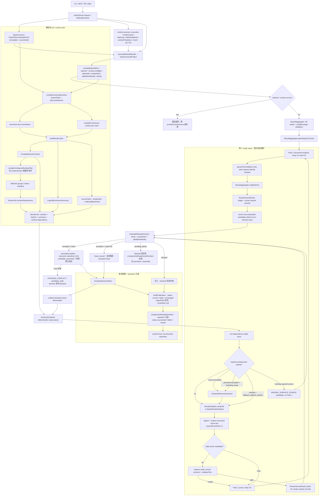
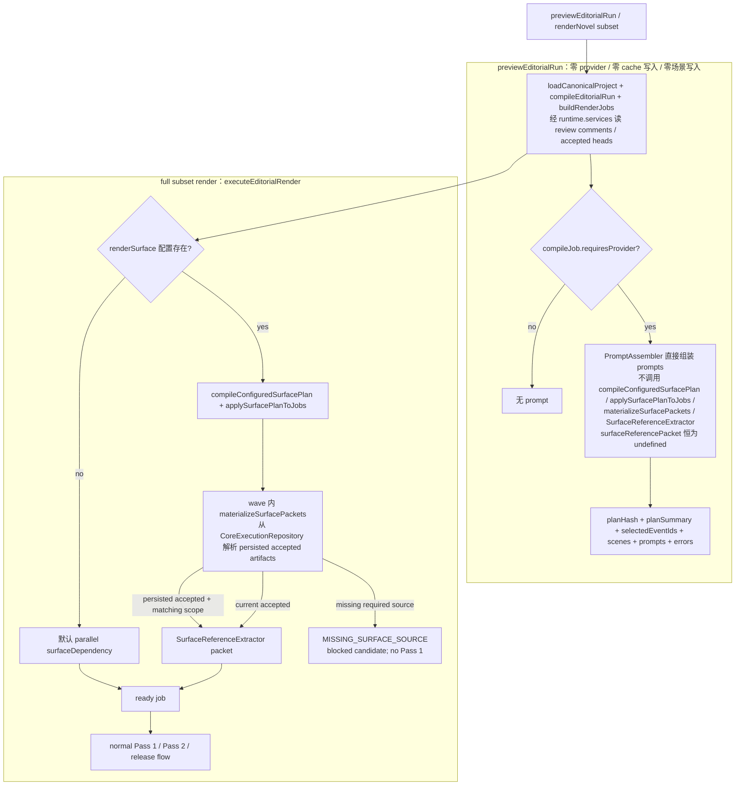
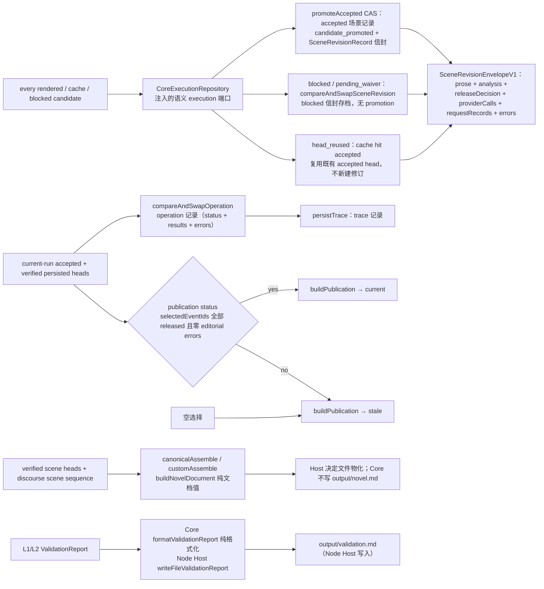

# 完整接线图：从 YAML 到发布工件

> **时间**: 2026-08-02 19:17 CST
>
> **当前基线**: 本文是 current reference，以 [当前系统状态](../current-state.md)（源码核验）为权威；源码优先于历史计划与阶段报告。
>
> **适用代码**: `packages/core/src/api.ts`、`entity/`（mapper、project-runtime、yaml-loader、source-analysis、timestamp）、`state/`（narrative-runtime、graph-adapter、graph-compiler、dag、story-boundaries、discourse-*、event-store、manager、snapshot）、`editorial/`（compiler、render-service、identity、facade、selector、workspace、query-service、source-workspace、review-facade）、`pipeline/`（render、output、surface-scheduler、circuit-breaker、release-decision、reverse-validate、interaction-gate）、`cache/`、`validator/`、`assembler/`（release-assembly、publication-model、novel）、`ports/`、`reporter/`
>
> **阅读目标**: 确认一个字段、一个场景、一次渲染结果在哪个边界被读取、编译、校验、缓存、发布或拒绝。
> **现状边界**: 本文以当前 `api.ts`、`editorial/render-service.ts`、`pipeline/render.ts`、scheduler、release decision 与 cache 源码为准。Core 只消费不可变 `ProjectSourceSnapshotV1` 与注入的语义端口；文件物化是 Node Host / Workbench Host 的职责。
>
> **验证记录**: [接线修复验证与完整性报告](../report/wiring-remediation-verification-2026-07-27.md)（2026-07-27 的历史快照，不代表当前实现）

---

## 1. 不可跨越的边界

| 边界 | 唯一来源 / owner | 禁止的旁路 |
|---|---|---|
| 文件 I/O | Host 边界：Node Host 的 `FileProjectSourceLoader` / `FileProjectSourceWriter` 与 execution/state/cache/report repositories；Core 只接收不可变 `ProjectSourceSnapshotV1` 与注入的 `CoreRuntimeServices` 端口 | core 内部创建 `FsStorage`、直接 `fs` I/O 或持有项目路径 |
| 逻辑世界状态 | `compileNarrativeRuntime()` → `compileStoryBoundariesFromGraph()`，内部复用 `applyNarrativeEvent()` | 从 accepted prose、Pass 2 或 surface packet 回写 WorldState |
| discourse 可见性 | `compileDiscourseBoundaries()` 的 `CompiledDiscourseRenderContext` | 用 `narrativeOrder` 猜 cursor、把 hint target 送入 prompt |
| Pass 2 契约 | `ResultAggregator.getAnalysisContract()` | prompt schema 与 parse schema 分叉 |
| 发布判定 | `evaluateReleaseDecision(candidate, scopeHash, validationIdentity, interactionManager?)` | output、cache 或 plugin 各自判断 `released` |
| 已接受场景 / 修订记录 | `CoreExecutionRepository`（Node Host `FileExecutionRepository` 的 CAS 提交；`compareAndSwapAcceptedScene` / `compareAndSwapSceneRevision` / `compareAndSwapPublication`） | `pipeline/output.ts` 或任何其他模块自行写 scene/response 文件 |
| surface prose | 仅 `AcceptedSceneArtifact` 经 `SurfaceReferenceExtractor` | 未接受 prose、scene `.md` 文件名、ellipsis 或 Pass 2 observation 充当 source |
| 最终小说 | Core `buildNovelDocument()` / `canonicalAssemble()` / `customAssemble()` 计算纯文档值；文件物化由 Host adapter 决定 | Core 直接写 `output/novel.md` 或 partial accepted set 仍装配完整小说 |

`narrativeOrder` 既不是组装顺序，也不是 replay/discourse/surface 的时间依据：reader 顺序由 discourse ledger（`ProjectData.discourseLedger`，恒非空）的 `chapters[].sceneIds` 经 `compileDiscourseSceneSequence()` 编译，`buildNovelDocument()` 按该序列拼接；`narrativeOrder` 只用于 catalog/selector 排序与 scene metadata。Surface packet 永远是 **non-authoritative**：YAML、scene contract 与 compiled context 优先。

---

## 2. YAML 到内部建模（render scheduling 之前）

### 2.1 已采用的 YAML 目录与文件合同

`EntityMapper.loadProject()` 消费不可变 `ProjectSourceSnapshotV1`（Host 物化的逻辑文档，按
logicalPath 排序）；它不读取一个泛化的 “definitions/events” blob，而是按以下路径逐一
读取、迁移并以对应 Zod schema 做 strict 校验。标准 Node Host loader 从 snapshot 中筛选
`.yaml` 文档；缺失的目录得到空数组。`definitions/state_initial.yaml` 与
`definitions/entity-types.yaml` 是**必需文件**（缺失抛 `ConfigError`，`Required YAML file
is missing`）；`definitions/discourse-ledger.yaml` 与 `_chapter.yaml` **可缺省**（ledger 缺省
时替换为 `id: 'empty'` 的占位 ledger，chapter metadata 缺省为 null）。
> **Story branch authoring**：EventFile 接受 strict event-local `choices`。外部
> `branches.yaml`、`branches/branch_points.yaml` 与 `branchPoint` 仍不被读取或接受。mapper
> 在 final mapping 前调用 `compileGameDialogueTree()`：root 保持 `{ type: 'all' }`，其余
> event 及普通 Fact 取 descendant leaf `BranchSet`，每个 choice 生成 scoped synthetic
> `system:branch-choice:<eventId>:<choiceId>` transition（写入 `runtimeEvents`）。
> `compileCanonicalRuntime()` 对 game-dialogue 项目要求完整的 ordered leaf `--branch-path`；
> `renderGameDialogueTree()` 用每个 node 的 representative path 渲染全树（产物为纯文档值，
> Host 决定是否物化 `dialogue-tree.md`）。discourse ledger 的 branch label 仍独立于 story path。

```mermaid
flowchart TB
  Root["project directory"] --> Config["nova.yaml<br/>project configuration"]
  Root --> Defs["definitions directory"]
  Root --> Chapters["chapters directory"]

  subgraph DefinitionFiles["definitions"]
    Defs --> State["state_initial.yaml required<br/>info; timeAnchors; threads; worldFacts"]
    Defs --> EntityTypes["entity-types.yaml required<br/>entity type catalog"]
    Defs --> Characters["characters recursive YAML<br/>character definitions"]
    Defs --> Locations["locations recursive YAML<br/>location definitions"]
    Defs --> Items["items recursive YAML<br/>item definitions"]
    Defs --> Factions["factions recursive YAML<br/>faction definitions"]
    Defs --> Relationships["relationships recursive YAML<br/>relationship definitions"]
    Defs --> Rules["rules recursive YAML<br/>rule definitions"]
    Defs --> Narrators["narrators recursive YAML<br/>narrator profiles"]
    Defs --> Assertions["assertions recursive YAML<br/>narrator assertions"]
    Defs --> Ledger["discourse-ledger.yaml optional<br/>missing → empty placeholder ledger"]
  end

  subgraph ChapterFiles["chapters/chapter_NN"]
    Chapters --> ChapterMeta["_chapter.yaml optional<br/>chapter; title; summary; intent; plannedScenes; styleGuidance"]
    Chapters --> EventYaml["E*.yaml<br/>EventFile"]
  end

  Config --> ProjectConfig["ProjectData.config"]
  State --> WorldInitial["ProjectData.worldInitialState<br/>and timeAnchors"]
  EntityTypes --> EntityTypeData["ProjectData.entityTypeCatalogSource"]
  Characters --> EntityDefs["ProjectData.characters"]
  Locations --> EntityDefs
  Items --> EntityDefs
  Factions --> EntityDefs
  Relationships --> RelationshipData["ProjectData.relationships"]
  Rules --> RuleData["ProjectData.rules"]
  Narrators --> NarratorData["ProjectData.narratorProfiles"]
  Assertions --> AssertionData["ProjectData.narratorAssertions"]
  Ledger --> LedgerData["ProjectData.discourseLedger"]
  ChapterMeta --> ChapterMap["ProjectData.chapters map"]
  EventYaml --> ChapterMap
```




#### 2.1.1 每类 YAML 的真实顶层结构

| 路径 | strict schema / 内部落点 | 作者可写顶层键 |
|---|---|---|
| `nova.yaml` | `projectConfigSchema` → `ProjectData.config` | identity（必填）：`project`、`title`、`author`；render：`defaultModel?`、`defaultLanguage?`、`genre?`、`synopsis?`、`tense?`（`past`/`present`）、`concurrency?`、`defaultSceneTextTarget?`、`cacheEnabled?`、`snapshotInterval?`；policy：`validatorOverrides?`、`logLevel?`、`traceLevel?`、`circuitBreaker? { maxRetries }`、`reviewExpiry? { enabled, autoResolveDays }`；style：`styleProfile?`、`ideaIR?`；integration：`plugins? { enabled }`、`renderSurface?`。schema 是 strict；**没有** `schemaVersion`、`outputDir`、`plugins.provider`。 |
| `definitions/state_initial.yaml` | `worldInitialStateSchema` → `ProjectData.worldInitialState`、`timeAnchors` | `info { currentEra, politicalSituation }`、`timeAnchors[] { id, at, description? }`（`at` 是 authored locatable story time：字符串或 `{ at }` / `{ after }` / `{ offset }` / `{ chapter }`，不接受 `indeterminate`）、`threads[] { id, name, description, type, targetRevealChapter, initialProgress, structuralFunction? }`、`worldFacts[] { id, value, description }`。 |
| `definitions/entity-types.yaml` | `entityTypeCatalogSourceSchema` → `ProjectData.entityTypeCatalogSource`（必需文件；序列化 source，编译时经 `compileEntityTypeCatalog` 生成 catalog） | 实体类型/属性/生命周期/引用资格的 author-facing catalog；实体属性与生命周期以项目自带 catalog 为准，不假定历史默认 catalog。 |
| `definitions/characters/**/*.yaml` | `characterDefinitionSchema` → `ProjectData.characters` → registry character | `id`、`name`、`type`、`description`、`initialState`、`traits`；optional `archetype`、`faction`、`role`、`voiceNotes`、`backstory`、`knownSecrets`、`appearance`、`aliases`、`gender`、`age`、`profession`。 |
| `definitions/locations/**/*.yaml` | `locationDefinitionSchema` → `ProjectData.locations` → registry location | `id`、`name`、`kind`、`description`、`initialState`；optional `parent`、`notableFeatures`。 |
| `definitions/items/**/*.yaml` | `itemDefinitionSchema` → `ProjectData.items` → registry item | `id`、`name`、`kind`、`description`、`initialState`。 |
| `definitions/factions/**/*.yaml` | `factionDefinitionSchema` → `ProjectData.factions` → registry faction | `id`、`name`、`kind`、`description`、`initialState`。 |
| `definitions/relationships/**/*.yaml` | `relationshipDefinitionSchema` → `ProjectData.relationships` | `id`、`type`、`participants`（恰好两项）、`bidirectional`、`initialState { trust, emotionalDistance, intensity, status, notes? }`；optional `establishedEvent`、`breakingEvent`。 |
| `definitions/rules/**/*.yaml` | `ruleDefinitionSchema` → `ProjectData.rules` → registry rule | `ruleId`、`name`、`category`、`type`、`statement`、`logicalConsequences[]`、`evidenceChain[]`；optional `ruleClass`、`exceptions[]`。 |
| `definitions/narrators/**/*.yaml` | `narratorProfileSchema` → `ProjectData.narratorProfiles` map | base `id`、`type`、`access`、`assertion`、`truth`、`fidelity`、`sincerity`；`retrospective_entity` 另需 `knowledgeBoundary`，`omniscient` 另需 `autoReveal: false`。 |
| `definitions/assertions/**/*.yaml` | `narratorAssertionSchema` → `ProjectData.narratorAssertions` map | `id`、`narrator`、`proposition`、`polarity`、`type`、`status`（`asserted`、`unknown` 或 `contested`）、`narrationBoundary { narratorId, focalizerId?, narrationTime? }`；optional `evidence`。`authoritative_reveal` 必须使用 `asserted` status；重复 assertion ID 是配置错误。 |
| `definitions/discourse-ledger.yaml` | **可选** `plannedDiscourseLedgerSourceSchema` → `compilePlannedDiscourseLedger()` → `ProjectData.discourseLedger`（恒非空；派生 SHA-256 `hash`） | `id`、`chapters[] { branch, chapter, sceneIds }`（每 branch 至少一章，章节号递增，scene 全局唯一）、`entries[] { id, sceneId, branch, discoursePosition, action }`。`action` 是 `reveal`、`claim`、`hint`、`retraction`、`correction`、`withhold_start` 或 `withhold_end` 的 discriminated union。缺失文件不报错：mapper 替换为 `{ id: 'empty', chapters: [{ branch: 'main', chapter: 1, sceneIds: ['__empty__'] }], entries: [] }` 占位；canonical render 仍要求 ledger 覆盖全部 event_file 场景，否则 `compileDiscourseSceneSequence()` 抛 `ConfigError`（phase `'discourse-sequence'`）。 |
| `chapters/chapter_NN/_chapter.yaml` | `chapterMetadataSchema` → chapter map metadata | `chapter`、`title`、`summary`、`intent`、`plannedScenes`；optional `styleGuidance`。 |
| `chapters/chapter_NN/E*.yaml` | `eventFileSchema` → `EventFile`（补 `logicalPath`） | 完整字段见下一表；`choices?` 是唯一 author-facing story branch 合同。`branchPoint` 与外部 branch scaffold 是未解析 legacy 格式。 |

#### 2.1.2 `E*.yaml`：EventFile 的真实结构与 Fact 变体

| EventFile 字段组 | 作者键 |
|---|---|
| identity / time | `event`、`narrativeOrder`、`title`、`storyTime?`、`narrationTime?`、`sceneType?`。`storyTime` / `narrationTime` 都接受 authored union（legacy 字符串或 `{ at }` / `{ after }` / `{ offset }` / `{ chapter }` / `{ type: indeterminate }`）；省略 = 运行时 `indeterminate/unspecified`。`causalPredecessors?[]`（非空、唯一）是显式 author-origin 前驱。 |
| scene / narrative metadata | `beats`（**必填**：至少一个非空字符串条目）、`discourseMode?`、`arcPosition?`、`emotionalValence?`、`conflictType?`、`resolutionType?`、`tense?`、`pov { character, type }`、`sceneBrief`。 |
| state transition / game choice | `preconditions[]`、`expectedPostconditions[]`、`choices?[] { id, label, description, targetEvent, effects? }`。ordinary Facts 与 choice effects 都复用同一 value / narrativeHint / unset 互斥合同；mapper 将 ordinary Facts 按 derived tree scope 映射，每个 choice effect 由 synthetic transition 在 target 的 stateBefore 前写入。 |
| context and effects | `styleGuidance?`、`threadProgress?`、`greyLines?`、`foreshadowing?`、`relationshipEffects?`、`ruleEffects?`、`introduces?`、`authorNotes?`、`targetAudience?`、`cast?`。 |
| source and narratology | `narrativeChecklist?`、`sourceContext?`、`duration?`、`frequency?`、`anachrony?`、`voice?`、`narratorProfileRef?`、`focalization?`（`type`：`zero`/`internal`/`external`，可带 `variation` 与 `characterSequence`）；narrative-technique 契约：`causalDiscontinuity?`、`surfaceMode?`、`causalMultiplicity?`、`irresolvableIndeterminacy?`、`absentApparatus?`、`voiceDissonance?`、`multiplicity?`、`metanarrativeLevel?`。 |

| Fact YAML 位置 | 必有键 | 允许的完整形式 | 映射语义 |
|---|---|---|---|
| `preconditions[]` | `entity`、`attribute` | `value` 与 `narrativeHint` 不可并存；`operator?` 为 `eq`、`neq`、`gt`、`gte`、`lt`、`lte`、`contains`、`not_contains`、`exists` 或 `not_exists`；比较 operator 要求 `value`，`exists` / `not_exists` 禁止 `value`；`confidence?`。 | mapper 加入 `id = entity.attribute`、story-time validity 与 `operator`，作为 render 前 state 条件。 |
| `expectedPostconditions[]` | `entity`、`attribute` | 三选一：`value`（可附 `operation: set`）；`operation: unset` 且无 `value` / `narrativeHint`；或仅 `narrativeHint`。可有 `confidence?`。`value` 与 `narrativeHint` 绝不共存。 | `value` / `unset` 交给 canonical story replay（写 / 删 `state.entities` 并追加 `state.facts`）；`narrativeHint` 不写 `state.entities`、不产生因果边，但 `applyPostconditions()` 会把 hint-only postcondition 追加到 `WorldState.facts` 事实日志（`ContextAssembler._buildWorldFacts()` 可消费），同时作为 Pass 2 semantic input。 |

`relationshipEffects[]` 为 `{ participants: [a, b], effect, direction, newState? }`；
`ruleEffects[]` 为 `{ rule, effect, evidence }`；`introduces[]` 为
`{ type, id, initialState }`。mapper 从两类 Fact、relationship participants 和 `pov.character`
收集 `NarrativeEvent.participants`，而不是从 prose 推断。

### 2.2 一份不可变 snapshot，不等于一次读取


`renderNovel()` 的输入是 `request.source: ProjectSourceSnapshotV1`（不可变文档集 +
内容身份 `sourceHash`），运行时只经注入的 `EditorialRuntime.services`（
`CoreRuntimeServices`：execution / renderCache / stateLog / stateSnapshots /
promptTemplates / clock / ids / llm）访问外部世界。Core 内部不创建任何 Storage，也不做
文件 I/O。

这不表示只发生一次映射：`executeEditorialRender()` → `loadCanonicalProject()`（
`entity/project-runtime.ts`）经 `EntityMapper.loadProject()`（snapshot 内逐文件 strict Zod
校验）、`InMemoryEntityRegistry.load()`（typed definitions + worldFacts-as-concepts +
entity-type catalog）并逐 `EventFile` 调用 `mapper.mapToNarrativeEvent()`。mapper pass 按
`sourceHash` 记忆化（上限 8 项），每次调用返回 fresh structured clones，绝不共享可变
runtime state；内容相同即身份相同，与 Host 路径、Git 或物化器无关。

> **与 `compileProject()` 的边界**：`renderNovel()` 走 canonical kernel（`loadCanonicalProject` +
> `compileCanonicalRuntime`），`compileProject()` 则返回 detached `ProjectCompilation`
> （`data` / `events` / `runtimeEvents` / `initialFacts` / `entityTypes` /
> `entityDeclarations` / 冻结的只读 `EntityLookup` / `boundaries`），同样不暴露 mapper、
> registry、`StateManager` 或可变 world state。两者都不合成 `system:genesis`；事件
> `introduces` 现在会生成 `system:introduction:<eventId>:<entityId>` transition（见 2.3）。


```mermaid
flowchart TD
  Snapshot[ProjectSourceSnapshotV1<br/>immutable documents + sourceHash] --> Loader["EntityMapper.loadProject<br/>over snapshot.documents"]
  Raw["validated project inputs from Section 2.1"] --> Loader
  Loader --> Parsed[per-file Zod schema validation over logical docs]

  Parsed --> Data[ProjectData]
  Parsed --> EventFile[EventFile with logicalPath]
  EventFile --> EventMap[EntityMapper.mapToNarrativeEvent per file]
  EventMap --> Facts[Fact preconditions and postconditions]
  EventMap --> Effects[thread relationship rule and lifecycle effects]
  EventMap --> Participants[participants derived from facts effects and POV]
  Facts --> Events[authored NarrativeEvent array<br/>no system:genesis]
  Effects --> Events
  Participants --> Events

  Snapshot --> Registry[InMemoryEntityRegistry.load<br/>typed definitions + worldFacts-as-concepts<br/>+ entity-type catalog]
  Registry --> RegistryState[entity state for initialFacts]
  Events --> Runtime[canonical kernel: loadCanonicalProject<br/>runtimeEvents = authored + system:introduction + system:branch-choice]
  Runtime --> Initial[initialFacts + initialThreads from state_initial.threads]
  RegistryState --> Initial
  Initial --> Boundaries[compileCanonicalRuntime<br/>compileStoryBoundariesFromGraph]
  Data --> Anchors[timeAnchors TimeAnchor[]]
  RenderOpts[render opts: branchPath + discourseBranch] --> Boundaries
  Anchors --> Boundaries
  Boundaries --> StateBefore[canonical stateBefore by event]
  Runtime --> RenderEvents[authored events selected for this render]
  StateBefore --> RenderEvents

  Data --> DiscourseInputs[ledger + assertion catalog + narrator profiles]
  RenderEvents --> Discourse[compileDiscourseBoundaries strict preflight]
  DiscourseInputs --> Discourse
  RenderOpts --> Discourse
  Discourse --> DiscourseContext[CompiledDiscourseRenderContext]

  StateBefore --> JobBuild[buildRenderJobs]
  DiscourseContext --> JobBuild
  RenderEvents --> JobBuild
  Registry --> JobBuild
  JobBuild --> Contract[CompiledSceneContract]
  JobBuild --> Summary[LogicalDisclosureSummary]
  Contract --> RenderJob[RenderJob]
  Summary --> RenderJob
  Data --> SurfacePlan[compileConfiguredSurfacePlan<br/>仅 full render 路径]
  Contract --> SurfacePlan
  SurfacePlan --> Dependency[surfaceDependency]
  Dependency --> RenderJob
  RenderJob --> Schedule[SurfaceScheduler ready waves]
```
> **无 StateManager**：editorial render 路径不构造 `StateManager`，也没有 snapshot 支路；
> `stateBeforeByEventId` 只来自 `compileNarrativeRuntime()` → `compileStoryBoundariesFromGraph()`，
> 绝不调用 `StateManager.getCurrentState()` 作为替代来源。`compileProject()` 同样只提供
> detached compilation projection，不返回 `StateManager` 或其它可变运行时内部对象。

> **为什么单独绘制**：本节只展开 YAML 提取与内部建模；第 3 节主图从已编译的内部模型开始，
> 不重复字段级 mapping，避免把调度、缓存与发布路径淹没。


### 2.3 提取与映射规则

| YAML 输入 | `ProjectData` / mapper 输出 | 后续内部建模 |
|---|---|---|
| `nova.yaml` | `config` | 形成 model、language、style、cache、surface plan 与 validator policy 的 project-level inputs。 |
| character、location、item、faction definitions | `characters`、`locations`、`items`、`factions` arrays | fresh `InMemoryEntityRegistry` 创建对应实体；character 的 aliases/gender/appearance/age/profession/traits 与各类 `initialState` 被 canonicalize 为 runtime state。 |
| relationship definitions | `relationships` array | 作为 relationship state 与 event `relationshipEffects` 的定义侧输入；不被伪装成 generic entity definition。 |
| rule definitions | `rules` array | registry 创建 rule entity；category/type 被提升为 runtime state，事件的 `ruleEffects` 再记录其变化/evidence。 |
| `state_initial.yaml`（必需） | `worldInitialState`、`timeAnchors` | canonical kernel（`loadCanonicalProject`）中，`worldFacts` 以 concept entity 状态进入 registry，不合成 `system:genesis`；threads 生成 `initialThreads`；anchors 保留为 `TimeAnchor[]`（`at` 是 authored locatable story time，`indeterminate` anchor 在 mapper 直接拒绝），由 `resolveTemporalContext()` 解析成 `coordinatesByAnchorId` / `coordinatesByEventId` / `narrationCoordinatesByEventId`（story 与 narration 坐标分开存放，后者仅为带 `narrationTime` 的事件填充）。`compileProject()` 返回这些规范化数据及编译后的 boundaries 快照，不暴露内部运行时。 |
| `entity-types.yaml`（必需） | `entityTypeCatalogSource` | `compileEntityTypeCatalog()` 编译为 `EntityTypeCatalog`，与 `EntityDeclarationCatalog` 一起构成 `catalogContext` 供 replay / context / validators 使用；实体属性、生命周期与引用资格以项目自带 catalog 为准。 |
| narrator profiles、assertions、discourse ledger | `narratorProfiles` map、`narratorAssertions` map、恒非空 `discourseLedger`（来自 `definitions/discourse-ledger.yaml`，缺省时是 `id: 'empty'` 占位） | `compileDiscourseBoundaries()` 与 `compileDiscourseSceneSequence()` 消费这些已校验的记录；canonical render 要求实际 ledger 覆盖全部 event_file 场景，否则 `ConfigError`（phase `'discourse-sequence'` / `'discourse-branch-resolve'`）。 |
| `_chapter.yaml`（可选）+ `E*.yaml` | `Map<chapter, { metadata, events }>`；每个 event 有 `logicalPath` | canonical kernel 逐文件 `mapToNarrativeEvent()`，`introduces` 生成 `system:introduction:<eventId>:<entityId>` transition（在 host event 前、同 story coordinate、同 branch scope；若该实体定义仍声明 `initialState` 则抛 `ConfigError`，phase `'introductions'`），`choices` 生成 `system:branch-choice:<eventId>:<choiceId>` transition；`compileProject()` 编译 source snapshot 并返回不可变投影。 |

### 2.4 “canonical” 的确切含义


1. `ProjectData` 与 `NarrativeEvent[]` 按 `(snapshot.sourceHash)` 记忆化（`loadCanonicalProject` 的内容缓存，上限 8 项），缓存内容是不可变 source data；等价字节产生等价身份。
2. 每次 `compileProject()` 都在 API 边界对 source data/events、catalog、实体查询结果与 boundaries 做 `structuredClone` 分离；`entities` 是冻结的 `EntityLookup` 普通对象，每次查询返回新鲜克隆，调用不能共享可变 state。editorial render 路径经 `loadCanonicalProject()` 拿到 fresh clones，同样不共享可变 state。
3. `compileStoryBoundariesFromGraph()` 用 initial facts/threads 和 branch-filtered 事件序列（经 `compileNarrativeGraphs` 的选择结果）计算，给每个 event 固定 `stateBeforeByEventId`。
4. `compileDiscourseBoundaries()` 独立给每个 event 固定 disclosure projection 与 cursor。
5. 后续 render job 只读取这两个编译结果；LLM prose、Pass 2、cache 和 surface packet 都不能反向修改它们。

### 2.5 时间戳解析（`parseStoryTimestamp` → `resolveTemporalContext`）

`entity/timestamp.ts` 是唯一 YAML 值 → 运行时 AST 的归一化边界：

- `parseStoryTimestamp()` 接受 authored union（字符串或 `{ at }` / `{ after }` / `{ offset }` / `{ chapter }` / `{ type: indeterminate }`）；省略 → `{ type: 'indeterminate', mode: 'unspecified' }`，显式 `indeterminate` → `mode: 'intentional'`（可带 `reason`）。
- `resolveTemporalContext()` 在 branch 过滤之前对**全部**事件解析：`day_N` / 裸 duration 字符串 → **story clock** 点（`scalar = 数值 × 对应 unit 的毫秒数`，`day` = `86_400_000`）；ISO 日期时间 → **calendar clock** 点（UTC 毫秒，带时区修正）；`chapter_N` → **chapter clock** 点（标量 = 章节号）；`indeterminate` → `{ type: 'storyTime', kind: 'unlocated' }`（不产生时间边）；事件/anchor 引用 → 解析到被引用点，`relative` 要求 story/calendar 点基（chapter 基被拒绝）。
- **引用错误是 resolver 错误**：未知引用（`Unknown story-time reference` / `Unknown event` / `Unknown time anchor`）、循环引用（`Cyclic story-time reference`）、重复/保留 ID、anchor 与事件 ID 冲突、非有限标量、非法 ISO 日期/时区，全部抛 `ConfigError`（phase `'timestamp'`），在 `compileStoryRuntimeGraph()` 之前失败。
- `compareStoryCoordinates()`：`initial` 早于一切；`unlocated` 或跨 clock 不可比；同 clock 按标量比较。

### 2.6 Editorial 预览与 selector（`previewEditorialRun` / `preflightSelector`）

`editorial/render-service.ts` 的 `previewEditorialRun()`（CLI `--dry-run` 的落点，取代旧 dryRun）是编译期预览：

- **零 provider 调用、零 cache 写入、零场景写入**：需要注入 runtime（execution 用于读 review comments / accepted heads，promptTemplates 用于 Pass 1 模板），`compileEditorialRun()` 编 plan → selector 或 revision 错误时直接返回 `errors` / `editorialErrors`（不抛）；只对 `requiresProvider` 的 job 用 `PromptAssembler` 组装 `prompts`。
- `discourseBranch` 解析：显式覆盖，否则 `resolveDiscourseBranch()` 按 ledger 场景集唯一匹配（缺失/歧义抛 `ConfigError`，phase `'discourse-branch-resolve'`）。
- 每场景身份：`sourceHash`（事件定义 + 全源文档内容）、`scopeHash`（`computeScopeHash(eventId, branchPath)` = SHA-256(canonicalJson({ eventId, branchPath }))）、`editorialBasisHash`（内容身份 + branch + revision basis）、`validationIdentity`（validator 集合 + overrides 的确定性指纹）；`planHash` 覆盖 selector、场景身份、branch/discourse、model、providerProfile、waiver hashes、feedback hashes、batch、maxRounds。
- `editorial/selector.ts` 的 `preflightSelector()` 是纯函数（无 storage/provider/clock）：未知事件 → `SCENE_NOT_FOUND`、off-branch → `SCENE_NOT_IN_BRANCH`、重复去重、结果按 narrativeOrder 排序；errors 累积在结果里从不抛。
---

## 3. Full render 主接线图



### 3.1 关键顺序

1. `compileCanonicalRuntime()`（`compileNarrativeRuntime` → `compileNarrativeGraphs` → `compileStoryBoundariesFromGraph` → `compileDiscourseBoundaries`）在 provider、cache lookup、plugin prompt hook 与 preview prompt 组装之前完成。
2. 每个 job 在 prose 前固定 `stateBefore`、scene contract、logical disclosure summary、source/scope/basis hash 和 surface dependency。
3. Surface scheduler 只在前驱 scene 的 current-run release `accepted` 后推进同一 serial lane；其它 lane 与 parallel group 不等待它。
4. cache 命中并不绕过分析契约或 validator：cached analysis 按当前 protocol 重新 parse、重新 `validatePost()`，随后仍由 release gate 判定。
5. `pending_waiver` 是已渲染、已存档但未发布的 candidate；不是 accepted 的弱别名。

---

## 4. Pass 1 / Pass 2 / plugin / cache 内部图

```mermaid
flowchart LR
  Job[RenderJob<br/>contract + context + summary + surface packet] --> LKey[LogicalRenderKey material]
  Job --> SKey[SurfaceRenderKey material]
  LKey --> CK[flat identity sha256Canonical logical + surface<br/>LayeredCacheKey v1: eventId + logical + surface]
  SKey --> CK

  PluginID[plugin identities] --> LKey
  AnalysisContract[ResultAggregator analysis contract hash + overrides] --> LKey
  Source[snapshot.sourceHash 内容身份 + scopeHash] --> LKey
  SurfaceSource[accepted predecessor prose hash + extractor version] --> SKey

  CK --> Cache{candidate cache via RenderCacheRepository}
  Cache -- valid --> Reparse[按当前 protocol 重新 parse cached Pass 2<br/>（current combined schema + prompt 材料）]
  Reparse --> Revalidate[ResultAggregator.validatePost + overrides]
  Revalidate --> Result[RenderSceneResult<br/>cache hit; no fabricated requests]

  Cache -- miss / stale / corrupt --> Decorate1[plugin Pass 1 decorations]
  Decorate1 --> P1Req[actual Pass 1 request record]
  P1Req --> Provider[injected provider / providerFactory]
  Provider --> Prose[prose]
  Prose --> Decorate2[plugin Pass 2 decorations]
  Decorate2 --> P2Req[actual Pass 2 request record]
  P2Req --> Analyze[AnalysisResult: eventId + protocol + observations + analysis]
  Analyze -- parse or Zod error --> Feedback[attempt-specific structured feedback]
  Feedback --> P2Req
  Analyze --> Validate[ResultAggregator]
  Validate --> Result

  Result --> Ledger[providerCalls + requestRecords<br/>promptHash = SHA-256(ordered provider-call identities)]
  Result -.tooling only.-> VKey[SurfaceValidationKey / AttemptKey 材料构建器与 computeFlatCacheKey<br/>仅 @novalistically/core/tooling 导出，渲染管线不调用]
```

### Plugin 限制

- Plugin 可注册 provider、validator，或返回受长度/ID 校验的 non-authoritative prompt decorations。
- `onBuildPass1Prompt` / `onBuildPass2Prompt` 的 transform 异常是 hard scene failure。
- Plugin 不能改写 story state、discourse state、logical summary、validator policy、release decision 或 accepted prose。
- plugin identity 进入 cache identity（`pluginIdentityHash`）；nova.yaml 的 `plugins` 只有 `enabled` 开关，插件在初始化时经 plugin registry/catalog（Node Host 提供 `NodePluginCatalog`）注册，`RenderPipelineOptions.pluginHooksManager` 只持有初始化时实际注册的 provider/validator。
---

## 5. Preview（previewEditorialRun）与 subset render 分支



**preview 规则**：`previewEditorialRun()` 不写任何文件，不调用 provider、不写 cache、不改变 state；需要注入 runtime（execution 用于读 review comments / accepted heads，promptTemplates 用于 Pass 1 模板）；prompts 只对 `requiresProvider` 的 job 生成。它**不参与** full render 的 surface planning/materialization：job 只有 `buildRenderJobs` 的默认 parallel `surfaceDependency`，`surfaceReferencePacket` 始终为空，因此 preview 目前**不能**解析 persisted predecessor prose，也**不会**返回 `MISSING_SURFACE_SOURCE`——不要把 preview 当作端到端 surface canary。CLI `nova render --dry-run` 直接走 `previewEditorialRun`。

**subset 规则**：full subset 走 `executeEditorialRender`，与全量 render 共用同一 surface plan / materialization 路径。没有被本次选中的 predecessor 不能从 scene 文件名、summary、Pass 2 observation、ellipsis 或跨 scope prose 补齐；只有 matching-scope 的 persisted `AcceptedSceneArtifact`（经 execution repository）可被 extractor 使用。

---

## 6. 工件与写入责任图



记录的唯一写入方是 editorial：`promoteAccepted()` / blocked 信封存档都经 `CoreExecutionRepository` 的 CAS 提交（Node Host `FileExecutionRepository` 落在 `.nova/execution/`，键只用于派生文件名）。`pipeline/output.ts` 只构建纯 JSON-safe output intents（`buildAndWriteOutputs()` 返回 `RenderOutputs`，不写文件）。**失败语义**：promotion 的 accepted-head CAS 冲突把受影响 scene 标为 `candidate_stale`（`STORAGE_CONFLICT`）并把 decision 改判 `blocked`；archive 失败使 operation 记录为 failed。两条路径都不会重跑 `evaluateReleaseDecision()`，也不会把已接受的 decision 静默改掉。

---

## 7. 文件与职责索引

| 文件 | 责任 |
|---|---|
| `packages/core/src/api.ts` | root 公开入口：`compileProject` / `validateNovel` / `getProjectStatus` / `listEntities` / `showEntity`；`/editorial` 提供 `renderNovel` / `renderGameDialogueTree` / `previewEditorialRun`（校验 runtime 后委托 `executeEditorialRender` 等） |
| `packages/core/src/entity/project-runtime.ts` | canonical kernel：`loadCanonicalProject()`（按 `sourceHash` 记忆化、fresh clones；收集 `introduces` 并生成 `system:introduction:*` transition，注入 `runtimeEvents`）与 `compileCanonicalRuntime()`（branch/discourse route 校验 + `compileNarrativeRuntime`） |
| `packages/core/src/entity/mapper.ts` + `yaml-loader.ts` | snapshot 内逐文件 Zod strict 校验与 `mapToNarrativeEvent()`；`compileGameDialogueTree()`（`system:branch-choice:*` transition）；discourse-ledger 可选 + 空占位 |
| `packages/core/src/entity/source-analysis.ts` | `analyzeSource()`：candidate source change 的纯分析（`previewSourceChange` 落点） |
| `packages/core/src/state/narrative-runtime.ts` | `compileNarrativeRuntime()`：graphs → story boundaries → discourse contexts 的固定生产顺序 |
| `packages/core/src/state/graph-adapter.ts` | `compileStoryRuntimeGraph()`（时间解析 + branch 过滤 + `system:initial` root 归并）与 `compileNarrativeGraphs()`（story + discourse 双图） |
| `packages/core/src/state/graph-compiler.ts` | 固定 12 阶段 `compileGraph()`：normalize outputs → reads → branch 过滤 → declarations → coordinate/order 校验 → 时间边 → provider/absence 推断 → commutativity → branch/closure/cycle → hash |
| `packages/core/src/state/dag.ts` | `buildStoryOrderIndex()`（Kahn 拓扑 + 事件 ID 决胜）、`isProvenBefore()` |
| `packages/core/src/entity/timestamp.ts` | `parseStoryTimestamp()` / `resolveTemporalContext()`（day_N story 标量、ISO calendar、chapter、indeterminate unlocated；引用/循环/未知 = resolver `ConfigError`，phase `timestamp`） |
| `packages/core/src/state/event-application.ts` | replay 与 story boundary 共用的 event effect 语义（`applyNarrativeEvent`） |
| `packages/core/src/state/story-boundaries.ts` | render/preview 的唯一 `stateBefore` / `stateAfter` oracle（`compileStoryBoundariesFromGraph`） |
| `packages/core/src/state/discourse-context.ts` | strict ledger/catalog/cursor preflight 与 safe projection（`compileDiscourseBoundaries`） |
| `packages/core/src/state/discourse-sequence.ts` | `compileDiscourseSceneSequence()`（ledger 章节块 → 场景序列，strict preflight）与 `resolveDiscourseBranch()`（唯一场景覆盖匹配） |
| `packages/core/src/editorial/compiler.ts` | `compileEditorialRun()` 纯编译：selector/revision preflight、每场景 identity、branch contracts、planHash、intents |
| `packages/core/src/editorial/identity.ts` | `computeSceneSourceHash` / `computeScopeHash` / `computeEditorialBasisHash` / `computeValidationIdentity` / `computePlanHash` / `computeSelectorHash` |
| `packages/core/src/editorial/render-service.ts` | `executeEditorialRender` / `executeEditorialTreeRender` / `previewEditorialRun`（编译 → plan → surface → 执行 → promote → 发布摘要 + operation 记录） |
| `packages/core/src/editorial/selector.ts` | `preflightSelector()` 纯校验：去重、narrativeOrder 排序、errors 累积不抛 |
| `packages/core/src/editorial/facade.ts` | `listSourceDocuments` / `getSourceDocument` / `previewSourceChange` / `getSceneRevision` / `getEditorialOperation` / `reviewServices` |
| `packages/core/src/editorial/review-facade.ts` | `listReviewComments` / `addReviewComment` / `replaceReviewComment` / `updateReviewComment`（经 execution 端口） |
| `packages/core/src/pipeline/render.ts` | cache lookup/revalidation（当前 protocol 重 parse + `validatePost`）、Pass 1/Pass 2、断路器重试、validator 调用、request ledger |
| `packages/core/src/pipeline/surface-scheduler.ts` | deterministic dependency-ready wave planning、persisted accepted artifact resolution |
| `packages/core/src/pipeline/release-decision.ts` | `accepted` / `pending_waiver` / `blocked` 的唯一判定（第 4 参 `interactionManager` 可选，编辑管线不传） |
| `packages/core/src/pipeline/output.ts` | 纯 JSON-safe output intents（`RenderOutputs` + `DerivedData` + `appendPlayerChoicesBlock`）；不写文件 |
| `packages/core/src/cache/render-cache.ts` | logical/surface 键材料、`computeSourceContentHash`（= `snapshot.sourceHash`）、`getCachedRender` / `setCachedRender`、cache diagnostics；validation/attempt 材料与 `computeFlatCacheKey` 仅 tooling 导出 |
| `packages/core/src/validator/aggregator.ts` | active validator identity（28 内置）、analysis contract、`validatePre` / `validatePost`（uncertainty preflight + observationRef/pointer 校验） |
| `packages/core/src/plugin/hooks-manager.ts` | plugin lifecycle、provider/validator registration、safe prompt decoration |
| `packages/core/src/reporter/validation-reporter.ts` | `formatValidationReport()` 纯 Markdown 格式化；`@novalistically/core/tooling` 导出 |
| `packages/core/src/assembler/release-assembly.ts` + `publication-model.ts` | `validateManifestHeads` / `canonicalAssemble` / `customAssemble` / `buildNovelDocument`（verified heads + discourse scene sequence → 纯文档值）；`buildPublication` 摘要 |
| `packages/core/src/ports/` | `CoreRuntimeServices` 与 `CoreExecutionRepository` / `RenderCacheRepository` / `StateLogRepository` / `StateSnapshotRepository` 语义端口 |
| `packages/node-host/src/` | `FileProjectSourceLoader` / `FileProjectSourceWriter`、`FileExecutionRepository`（`.nova/execution`）、`FileRenderCacheRepository`（`.nova/render-cache`）、`FileStateLogRepository` / `FileStateSnapshotRepository`（`.nova/state-log` / `.nova/state-snapshots`）、`writeFileValidationReport`（`output/validation.md`）、`AiSdkProvider` / `FileMockPass2Provider`、`createFileCoreRuntimeServices` |

## 8. 运行时排障顺序

1. 先看该 event 的 `RenderNovelSceneResult`（operation 记录 / scene 结果）：`releaseDecision.status`、`reasons`、`errors`、`analysis`、`providerCalls`；记录经 `CoreExecutionRepository` 读取（Node Host 落在 `.nova/execution/`，可用 `getEditorialOperation` / `getSceneRevision` 查询）。
2. `blocked` 且 reason 含 `MISSING_SURFACE_SOURCE`：检查 surface group/lane、predecessor 的 accepted 状态和 `scopeHash`（matching-scope 的 persisted `AcceptedSceneArtifact` 才可用）。
3. `pending_waiver`：说明没有 error-severity issue，但 warning 尚未有对应 waiver（当前编辑管线不消费请求级 waivers）；candidate 不会进入 promotion 或 assembly。
4. `cacheHit: true`：确认结果中 `requestRecords: []`，这是刻意不伪造旧请求的行为。
5. 小说未生成或过时：`buildPublication()` 的 `status`（`current` / `stale` / `unchanged`）与 `reasons` 说明原因；小说文档值由 `canonicalAssemble` / `customAssemble`（`buildNovelDocument`）计算，文件物化由 Host 决定。不要以文件是否存在判断发布状态。
